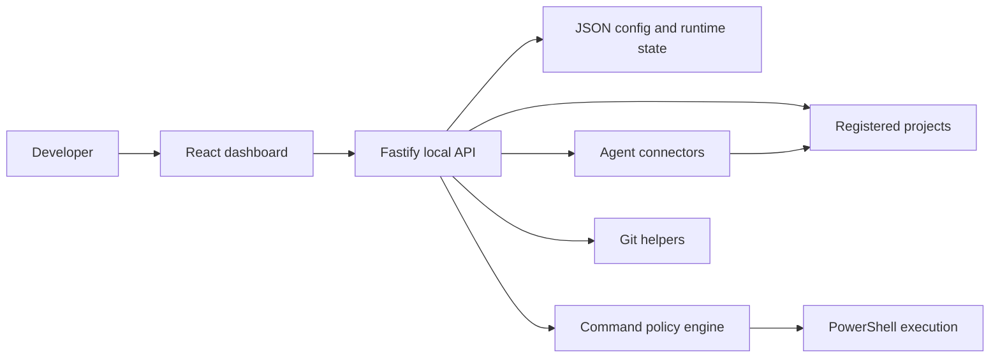

# DragonForge Technical Manual

## 1. Purpose

DragonForge is a Windows-first orchestration layer for local AI-assisted development. It is designed for developers who want model help inside existing projects while still keeping command execution, project boundaries, Git behavior, and auditability under explicit local control.

The MVP deliberately does not try to become a hosted model platform. Instead, it coordinates locally installed tools such as Claude, Codex, and Kimi through a controlled application shell.

## 2. System Overview



Core design principles:

- Local first: bind to `127.0.0.1` and operate on local workspaces.
- Explicit authority: DragonForge owns project registration, command previews, approvals, and logs.
- Inspectability: JSON storage and transcripts remain easy to read during the MVP stage.
- Conservative automation: models may analyze and propose, but risky execution remains controlled by policy.

## 3. Repository and Runtime Layout

### Development repository

```text
apps/
  dashboard/        Vite + React frontend
  server/           Fastify API and orchestration logic
packages/
  shared/           Shared schemas, types, defaults
  ui/               Shared UI package placeholder
config/             Runtime config plus public example files
projects/           Registered project data and managed workspaces
logs/               Command logs, audit logs, agent transcripts
scripts/            Launch and helper scripts
docs/               Project documentation
```

### Important source areas

- `apps/server/src/api`: HTTP route modules.
- `apps/server/src/agents`: connector discovery, task execution, task lifecycle.
- `apps/server/src/commands`: command policy and approval storage.
- `apps/server/src/git`: Git command preview helpers.
- `apps/server/src/projects`: registration and project scanning.
- `apps/server/src/storage`: JSON persistence utilities.
- `packages/shared/src/index.ts`: shared schemas, domain contracts, defaults.

## 4. Runtime Components

### Dashboard

The dashboard currently exposes:

- `Dashboard`: projects, approvals, connector readiness, recent commands, and live AI activity.
- `Projects`: register or remove local projects, preview GitHub clone operations.
- `Workspace`: project scan summary, Git status, task creation, image attachments, and task history.
- `Command Preview`: inspect a command before it enters the approval queue.
- `Approvals`: approve or reject queued commands.
- `Logs`: command history and agent transcripts.
- `Settings`: inspect and edit settings, permissions, and model routing JSON.

### API server

The API is implemented in Fastify and listens on `127.0.0.1:4545` by default. Startup ensures required directories and JSON files exist, then recovers any interrupted agent tasks from a previous shutdown.

### Shared package

The shared package provides:

- Zod request validation schemas.
- Command categories, permission levels, and risk levels.
- Project, command, connector, and agent task types.
- Default settings, default permission policy, and default model routing.

## 5. Project Workflow

1. A user registers a project root.
2. DragonForge scans the tree and records:
   - source count
   - asset folders
   - build folders
   - project markers
   - project types
   - SDL signals
   - suggested build or test commands
3. The workspace can read Git status and expose command suggestions.
4. The user starts an agent task with a role and optional provider choice.
5. The connector runs inside a constrained mode and writes a transcript.
6. DragonForge displays the result, task status, and live heartbeat-backed activity state.

The project scanner currently recognizes:

- CMake
- Make
- Node
- `.NET/Visual Studio`
- Visual C++
- SDL/C signals inferred from CMake or C-family includes

## 6. Agent Model

### Roles

| Role | Responsibility |
| --- | --- |
| `architect` | Plan work, decompose tasks, choose workflow. |
| `explorer` | Read code, map structure, identify likely causes. |
| `implementer` | Propose implementation work within the task boundary. |
| `build-runner` | Suggest exact commands and verification steps. |
| `reviewer` | Review diffs, tests, regressions, and risks. |

### Connectors

| Connector | Current mode | Notes |
| --- | --- | --- |
| Claude | plan-only | Best suited to planning and review when the CLI is available and authenticated. |
| Codex | read-only | Runs through `codex exec` with read-only sandboxing and captured transcripts. |
| Kimi | guided or CLI | Can prepare manual prompts when no CLI is installed. |
| DeepSeek | placeholder | Reserved for future implementation. |

### Task lifecycle

Agent tasks use these states:

- `queued`
- `running`
- `completed`
- `failed`
- `cancelled`

Each task also records an activity object with:

- activity state
- message
- last heartbeat time

While a connector is active, DragonForge refreshes the heartbeat every five seconds. This lets the UI distinguish an active task from a stale or interrupted one.

## 7. Command Safety Model

### Permission levels

| Level | Meaning |
| --- | --- |
| `auto` | Safe read-only operations may run automatically. |
| `preview` | Show the action and risk before execution. |
| `approval` | Require explicit user approval. |
| `blocked` | Do not execute through DragonForge. |

### Default policy

| Action | Default |
| --- | --- |
| Read files | `auto` |
| Search files | `auto` |
| Write files | `approval` |
| Build or test | `preview` |
| Install dependencies | `approval` |
| Git read operations | `auto` |
| Git branch or checkpoint operations | `preview` |
| Git commit | `approval` |
| Delete operations | `approval` |
| Network operations | `approval` |
| Writes outside project root | `blocked` |

### Command classification

The policy engine:

- normalizes command text
- detects command category
- detects shell operators and redirection
- checks blocked patterns
- validates whether a mutating command would run outside the registered project root
- computes risk, policy level, expected writes, and warnings

Blocked examples include:

- `git reset --hard`
- `git clean -fd`
- `git checkout -- .`
- `Remove-Item -Recurse -Force`
- `Set-ExecutionPolicy`
- whole-drive formatting patterns

## 8. Storage Model

DragonForge uses JSON files for MVP persistence:

| Path | Purpose |
| --- | --- |
| `config/dragonforge.json` | Server, dashboard, install, and Git settings. |
| `config/permissions.json` | Policy defaults and remembered approvals. |
| `config/models.json` | Connector configuration and routing. |
| `projects/registered.json` | Registered projects and scan summaries. |
| `logs/commands/queue.json` | Command queue state. |
| `logs/agents/tasks.json` | Agent task state. |
| `logs/audits/audit.jsonl` | Audit trail. |

Writes are performed through temporary files followed by rename, which reduces the chance of partial writes. Corrupt JSON is backed up and replaced with defaults when possible.

Public repositories should commit the `*.example.json` templates, not machine-specific runtime files.

## 9. API Reference

### Health

| Method | Route | Purpose |
| --- | --- | --- |
| `GET` | `/api/health` | API readiness check. |

### Projects

| Method | Route | Purpose |
| --- | --- | --- |
| `GET` | `/api/projects` | List registered projects. |
| `POST` | `/api/projects/register-local` | Register a local project root. |
| `POST` | `/api/projects/clone` | Create a Git clone preview. |
| `GET` | `/api/projects/:id` | Read one project. |
| `GET` | `/api/projects/:id/status` | Read project plus Git status. |
| `DELETE` | `/api/projects/:id` | Remove a project from the registry. |
| `POST` | `/api/projects/:id/scan` | Scan and update project metadata. |

### Commands

| Method | Route | Purpose |
| --- | --- | --- |
| `GET` | `/api/commands` | List command records. |
| `POST` | `/api/commands/preview` | Create a command preview. |
| `POST` | `/api/commands/request-approval` | Queue a command for approval. |
| `POST` | `/api/commands/:id/approve` | Approve and run a queued command. |
| `POST` | `/api/commands/:id/reject` | Reject a queued command. |
| `GET` | `/api/commands/:id/log` | Read execution log output. |

### Agents

| Method | Route | Purpose |
| --- | --- | --- |
| `GET` | `/api/agents/connectors` | List connector availability. |
| `GET` | `/api/agents/tasks` | List agent tasks. |
| `POST` | `/api/agents/tasks` | Create an agent task. |
| `GET` | `/api/agents/tasks/:id` | Read one agent task. |
| `POST` | `/api/agents/tasks/:id/run` | Start an agent task. |
| `POST` | `/api/agents/tasks/:id/cancel` | Cancel an agent task. |
| `GET` | `/api/agents/runs/:id/log` | Read task lifecycle log entries. |

### Git

| Method | Route | Purpose |
| --- | --- | --- |
| `GET` | `/api/git/:projectId/status` | Read Git status. |
| `POST` | `/api/git/:projectId/diff` | Read Git diff. |
| `POST` | `/api/git/:projectId/checkpoint` | Preview a checkpoint operation. |
| `POST` | `/api/git/:projectId/branch` | Preview a task branch. |
| `POST` | `/api/git/:projectId/stage` | Preview staging files. |
| `POST` | `/api/git/:projectId/commit` | Preview a commit. |
| `POST` | `/api/git/:projectId/rollback-checkpoint` | Preview rollback behavior. |

### Settings

| Method | Route | Purpose |
| --- | --- | --- |
| `GET` | `/api/settings` | Read app settings. |
| `PATCH` | `/api/settings` | Update app settings. |
| `GET` | `/api/models` | Read connector settings and routing. |
| `PATCH` | `/api/models` | Update model config. |
| `PATCH` | `/api/models/:provider` | Update one provider. |
| `GET` | `/api/permissions` | Read command policy settings. |
| `PATCH` | `/api/permissions` | Update command policy settings. |

## 10. Launch, Build, and Operations

### Development

```powershell
npm install
npm run build
npm run dev
```

### Standard local launch

```powershell
.\scripts\launch.ps1
```

Fallback launcher:

```powershell
.\scripts\launch.cmd
```

### Diagnostics

```powershell
.\scripts\doctor.ps1
```

The `doctor` helper is intended to surface local environment issues such as missing runtimes or unavailable tools.

## 11. Extension Points

Good next implementation seams:

- file diff approval workflow
- stronger Git checkpoint and rollback behavior
- release packaging profiles
- project templates
- richer diagnostics for SDL/C assets and compiler failures
- additional connectors such as DeepSeek and local/offline providers
- persistent database-backed storage after the JSON MVP phase

## 12. Current Limitations

- File write approval is not yet implemented end to end.
- Git mutating routes currently generate previews rather than completing a full safe-edit workflow.
- Connector execution depends on local CLI availability and account state.
- Kimi guided mode is intentionally manual when no CLI is present.
- JSON storage is transparent and convenient, but not intended as the final persistence layer for larger deployments.

## 13. Troubleshooting Notes

| Symptom | Likely cause | First check |
| --- | --- | --- |
| Dashboard does not open | launcher or dev server did not stay running | confirm local ports and rerun launch script |
| Claude appears missing | CLI not authenticated or unavailable | run `claude auth status` |
| Agent task remains stale | connector or server was interrupted | inspect heartbeat, transcript, and task state |
| Project scan misses build signals | marker files are nested or nonstandard | inspect scanner output and project markers |
| Git commands are blocked | operation is mutating or destructive | review generated preview and permission policy |

## 14. Intended Evolution

DragonForge is best understood as a safety-conscious orchestration shell that can grow into a broader local development control plane. The current MVP proves the essential idea:

1. discover local projects
2. route role-specific agent work
3. keep mutating actions visible
4. preserve human review
5. log the entire process
